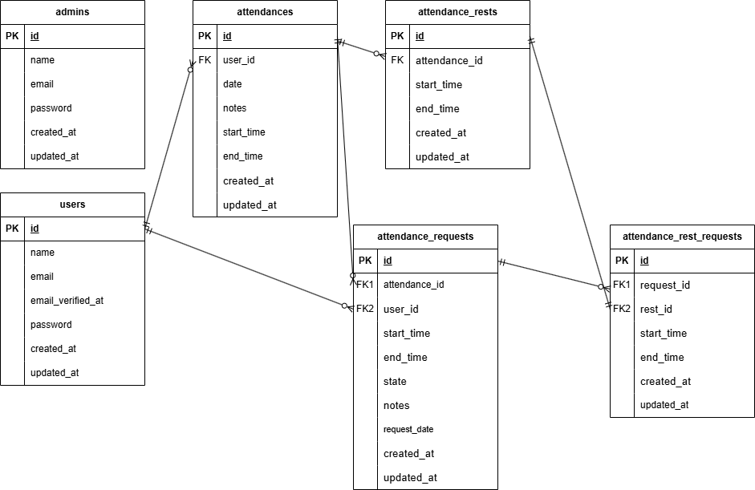

## 環境構築
Dockerビルド
1. git clone https://github.com/Takaaki39/attendance-app.git
2. cd attendance-app/
3. docker-compose up -d --build

※エラー(Error response from daemon: Conflict.)が出た場合はdocker-compose downなどしてコンフリクトしてるコンテナを削除して再度3.を実行してください。

※MySQLはOSによって起動しない場合があるのでそれぞれのPCに合わせてdocker-compose.ymlファイルを編集してください。

Laravel環境構築
1. docker-compose exec php bash
2. composer install
3. cp .env.example .env
4. php artisan key:generate
5. php artisan migrate
6. php artisan db:seed
7. php artisan storage:link
8. exit
9. ※windowsの場合 : sudo chmod -R 777 *

テストアカウント
1. 管理者
     + email: admin@example.com
     + password: password
2. 一般ユーザー
     + email: user@example.com
     + password: password

テスト準備
1. docker-compose exec mysql bash
2. mysql -u root -p
3. パスワードはroot
4. CREATE DATABASE attendance_test;
5. exit 2回
6. docker-compose exec php bash
7. php artisan key:generate --env=testing
8. php artisan config:clear
9. php artisan migrate --env=testing

テスト実行
1. php artisan config:clear
2. vendor/bin/phpunit

## 使用技術(実行環境)
- php 8.1.33
- Laravel 8.83.29
- MySQL 8.0.26
- MailHog

## ER図

## URL
- 開発環境：
- 一般ユーザー：http://localhost/attendance
- 管理者：http://localhost/admin/attendance/list
- phpMyAdmin：http://localhost:8080/
- MailHog：http://localhost:8025/
##
